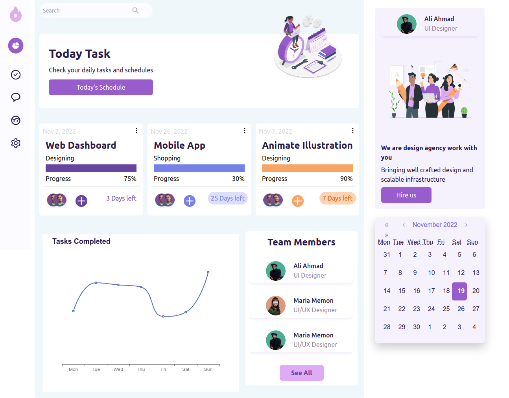

# Digital Assets

   This Project for Relative startup test assignment

## Build with

* [React.js](https://reactjs.org/docs/getting-started.html)
* [WindiCss](https://windicss.org/)

# Getting Started with Create React App

This project was bootstrapped with [Create Next App](https://nextjs.org/docs/api-reference/create-next-app).

## Available Scripts

In the project directory, you can run:

### `npm install`

All npm packages are first install

### `npm run dev`

Runs the app in the development mode.\
Open [http://localhost:3000](http://localhost:3000) to view it in the browser.

The page will reload if you make edits.\
You will also see any lint errors in the console.

#### Screenshot

